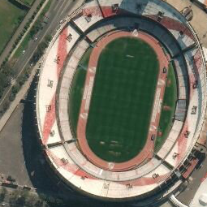
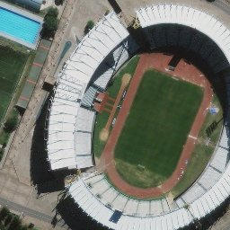
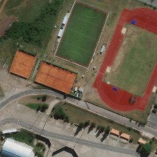
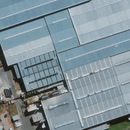

# stadium_cnn
A sample project working with keras to analyze satellite imagery.

# Introduction

As a study project following the read of *deep learning with keras* book by f.chollet, I've come up with the idea of using transfer learning with semi-automatic annotated datasets. In particular, gathering positions of landmarks within a city which their position is already known and annotated and then extracting their image representation. 

I've think that  *soccer stadiums* could be a good fit for this idea because stadiums possibly stand-out from the city-scape in terms of size, color and shape. 

I know finding stadiums automatically does not add any real-world value but the purpose of this project is 
to gain insights and xp on extracting value from satellite images and leveraging ML to do so.

# Project

The project is divided into 3 notebooks:

- extract_stadiums.ipynb ( Feature Extraction ) We take satellite images and generate a dataset for training.

- training_explained.ipynb ( Training ) We use the dataset to train a RNN capable of classifying satellite images.
- discover_explained.ipynb ( Discover ) We use the trained RNN to automatically find new samples in unseen data.

sample extracted stadium image:

# Results

- DEC 2019: the trained model was able to detect some stadiums in unseen data but it also produced a larger set of false positives. 

### some succesful detections

### some false positives

# Next steps

- Augment dataset( very few positive samples)
    - Create images with partial sections of stadiums instead of full centered image
    - scale, rotate, warp positive samples. 
- Reduce noise in training set:
    - Positive samples contain images of both  the stadium and its surroundings (e.g assuming the parking outside the stadium its a stadium itself). Explore the idea of leaving only the stadium section in the training data and assess effects. Can we train on partial images and then evaluate on mixed images? 
- Better model diagnostics
    - See data points where model makes mistakes
